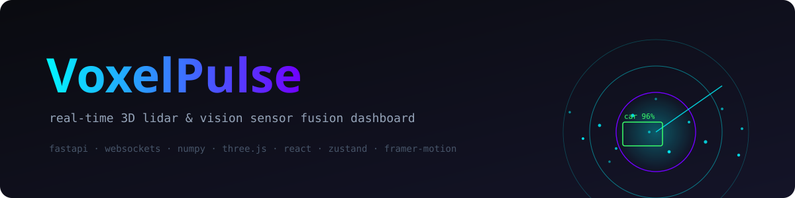

<div align="center">



# VoxelPulse

**Real-Time 3D LiDAR & Vision Sensor Fusion Suite — v2.0**

An AAA cyber-cockpit dashboard for streaming, processing, measuring and exporting
3D point clouds. Runs at 30 FPS against the FastAPI telemetry backend — and,
thanks to its built-in browser simulation engine, **works standalone on GitHub
Pages with zero configuration**.

[](https://github.com/muhammadmahadazher/VoxelPulse/actions)
[](https://github.com/muhammadmahadazher/VoxelPulse/actions)
[](LICENSE)
[](https://muhammadmahadazher.github.io/VoxelPulse/)
[](frontend/package.json)
[](frontend/package.json)

</div>

---

## 🌐 Live Demo

**https://muhammadmahadazher.github.io/VoxelPulse/** — deployed automatically on
every push to `main`. The dashboard detects static hosting, fails over to the
in-browser WebWorker simulation engine within 3 seconds, and streams a full
synthetic LiDAR scene (points, tracks, camera feed) at 30 FPS with no backend.

## ✨ Features

### Fusion Engine
- **30 FPS binary telemetry** — FastAPI WebSocket pushing packed `Float32Array` frames (~480 KB at 25k points) with a 10-byte `VPF1` binary header protocol.
- **Standalone simulation mode** — a WebWorker port of the backend generator (urban / warehouse / drone scenarios) with seamless WebSocket failover for static hosting.
- **Synthetic sensor engine** — dynamic scenes with moving vehicles, AGVs, forklifts, pedestrians and drones; per-point intensity, lane markings, range-dependent noise; ground-truth oriented boxes `[x, y, z, dx, dy, dz, yaw]` + confidence.
- **Processing pipeline** — RANSAC ground-plane segmentation, voxel hashing, union-find Euclidean clustering with PCA yaw (pure NumPy).
- **File upload** — backend parser for `.las` / `.ply` / `.pcd`, plus client-side drag & drop.

### AAA Visualization
- **Custom GLSL point shader** — anti-aliased gaussian soft discs (no square sprites), natural 1/d perspective size attenuation, per-point intensity and ROI rejection in-shader.
- **6 switchable colormaps** — Cyber-Neon, Turbo, Viridis, Infrared (ToF echo), Height/Z-slice, Velocity-flow shimmer.
- **Post-processing stack** — UnrealBloom HDR glow, cinematic vignette, chromatic aberration (togglable).
- **Radar ground** — glowing concentric range rings (10/25/50/100 m), cross axes, and a continuous 360° spinning sweep beam.
- **Holographic tracks** — corner-bracket wireframes with pulsing opacity, rotating target reticles, 3D velocity vectors, and billboard badges `[CLASS | RANGE m | CONF %]`.

### Power-User Toolset
- 📏 **3D measurement ruler** (`M`) — click two points, get exact Euclidean distance with a glowing dimension line.
- 🔍 **Point inspector** — hover raycasting with live XYZ, range, and 0–255 intensity readout.
- 📂 **Drag & drop loader** — drop `.ply` / `.pcd` / `.xyz` files straight into the viewport.
- ✂️ **ROI slicer** — GPU-side crop box with per-axis min/max sliders.
- 🖥️ **Multi-camera PiP** — Front / Rear RGB and Bird's-Eye-View radar, resizable, with synced 2D boxes and crosshairs.
- ⌘ **Command palette** (`Ctrl+K`) — colormaps, layers, cameras, scenarios, exports, everything.
- 📸 **Snapshot & export** — watermarked high-res PNG screenshots (`S`) and `.PLY` point dumps (`E`).

## 🚀 Quick Start

```bash
git clone https://github.com/muhammadmahadazher/VoxelPulse.git
cd VoxelPulse
./start.sh        # macOS / Linux   (Windows: start.bat)
```

Open **http://localhost:5173** — the launcher installs everything and boots both
servers. No backend? The dashboard automatically switches to SIM ENGINE mode.

<details>
<summary><b>Manual setup</b></summary>

```bash
# Backend (http://localhost:8000)
cd backend
pip install -r requirements.txt
uvicorn app.main:app --reload --port 8000

# Frontend (http://localhost:5173)
cd ../frontend
npm install
npm run dev
```
</details>

## ⌨️ Keyboard Shortcuts

| Key | Action | Key | Action |
|---|---|---|---|
| `Ctrl/⌘ K` | Command palette | `Space` | Pause / resume |
| `R` | Reset orbit camera | `T` | Top-down view |
| `F` | Chase FPV camera | `C` | Cycle colormap |
| `M` | 3D ruler | `S` | PNG snapshot |
| `E` | Export `.PLY` | | |

## 🏗 Architecture

```
┌─────────────────── Backend (FastAPI, optional) ───────────────────────┐
│  telemetry_generator.py → processing.py → main.py                     │
│  synthetic LiDAR+RGB      RANSAC · voxel   /ws/stream (binary VPF1)   │
│  scenes: urban/warehouse  clustering      /api/upload .las/.ply/.pcd  │
└──────────────────────────────┬─────────────────────────────────────────┘
              30 FPS binary frames │ ⇣ failover after 3 s
┌─────────────────────────────────┴──────────────────────────────────────┐
│  Frontend (React 18 · TypeScript · Three.js · Zustand)                 │
│  ws.ts ──▶ store ──▶ GLSL soft-disc points (6 colormaps, ROI, bloom)   │
│   └▶ simWorker.ts (WebWorker sim engine for static hosting)            │
│   ──▶ holo boxes + radar ground ──▶ PiP F/R/BEV ──▶ palette & tools    │
└────────────────────────────────────────────────────────────────────────┘
```

## 📡 Wire Protocol (`VPF1`)

```
[4B magic "VPF1"][2B header_len u16][header JSON][payload]
payload = positions f32×3N  ++  intensity f32×N  ++  camera RGB u8×(W·H·3)
```
The header carries `ts`, `n`, oriented 3D boxes with class + confidence, and
camera-space 2D boxes for the PiP overlay. Text commands flow client → server:
`{"cmd":"set_points","n":50000}`, `{"cmd":"regen"}`.

## 📁 Repository Layout

```
backend/                     # FastAPI telemetry server (optional for demo)
  app/main.py                #   WebSocket stream + upload parser
  app/telemetry_generator.py #   synthetic scene engine
  app/processing.py          #   RANSAC / voxel / clustering
  samples/                   #   demo .ply / .pcd clouds
frontend/
  src/sim/simWorker.ts       # standalone WebWorker simulation engine
  src/scene/                 # Viewport, shaders, holo boxes, radar ground
  src/ui/                    # HudBar, PiP, LeftPanel, palette, inspector
  src/utils/                 # file parsers, PNG/PLY exporters
.github/workflows/           # ci.yml (test+build) · deploy.yml (Pages)
start.sh / start.bat         # one-click launchers
```

## 🔁 CI/CD

- **ci.yml** — backend smoke tests (frame builder, RANSAC, clustering) + strict-TypeScript frontend build on every push/PR.
- **deploy.yml** — builds with `GITHUB_PAGES=true` base path, uploads the artifact, and deploys to GitHub Pages via the official `deploy-pages` action. Enable **Settings → Pages → Source: GitHub Actions** once.

## 🛠 Tech Stack

**Backend** — Python 3.12 · FastAPI · Uvicorn · NumPy
**Frontend** — React 18 · TypeScript (strict) · Vite · Three.js · @react-three/fiber & drei · postprocessing · Zustand · Framer Motion · Tailwind CSS · Lucide

## 🗺 Roadmap

- [ ] ROS2 rclpy bridge node (live sensor ingestion)
- [ ] DBSCAN/Open3D clustering backend option
- [ ] ICP odometry & SLAM-style trail rendering
- [ ] Session recording / timeline playback
- [ ] Live sensor SDKs (Velodyne / Ouster / Livox)

## 🤝 Contributing

PRs welcome! Fork, branch (`feat/…`), and open a pull request — CI runs backend
smoke tests and the strict frontend build on every push.

## 📄 License

MIT © [Muhammad Mahad Azher](https://github.com/muhammadmahadazher)
