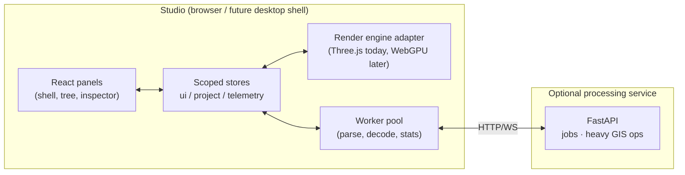
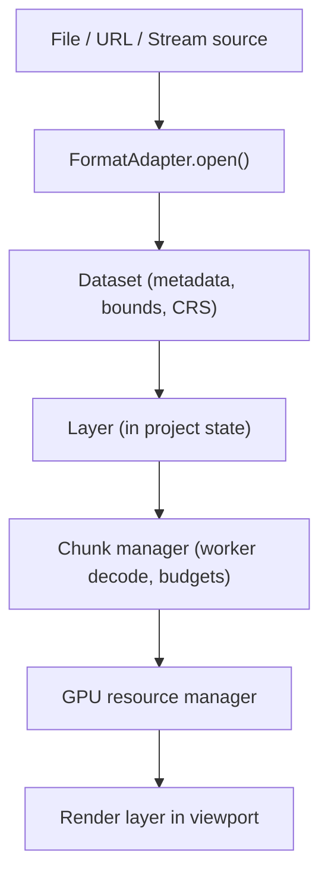

# VoxelPulse v4 Architecture

Target: a GPU-accelerated, point-cloud-first spatial computing studio that
grows from today's perception dashboard into LiDAR/GIS/terrain tooling without
rewrites. Phase 1 lands the workspace shell and state boundaries; later phases
plug into the seams defined here.

## Process topology



The studio must remain fully functional with the service absent (current
behavior, preserved).

## Package boundaries (logical today, physical monorepo later)

```
core        types, math, ids, SpatialReference
pointcloud  buffers, LOD/chunk model, budgets, EDL
formats     FormatAdapters: las/ply/pcd/xyz → Dataset   (+laz/copc later)
scene       Layer types, camera, gizmos, picking
workspace   workspace tabs, layout persistence
project     .vxp serialization, recent projects, autosave
ui          Spatial Glass components (panels, menus, palette)
workers     generic worker pool + tasks
```

Phase 1 keeps these as folders under `frontend/src/` with enforced import
direction (ui → stores → core; never ui → renderer internals). Physical
monorepo split (pnpm workspaces) deferred until a second consumer exists —
see ADR-0002.

## Dataset lifecycle (Phase 2 target, seams landed in Phase 1)



Large arrays never enter React state: the renderer owns typed-array buffers;
React receives layer ids and metadata only (already true for the live stream —
`PointCloud` swaps buffers inside `useFrame`).

## State architecture

| Store | Contents | Persistence |
|---|---|---|
| `uiStore` | panel sizes, open menus, palette, toasts, theme | localStorage |
| `projectStore` | project meta, layers, selection, dirty flag, recents | `.vxp` files + localStorage recents |
| telemetry store (existing `store.ts`) | frames, timeline history, stats, stream mode | none (ephemeral) |

Undo/redo (later phases) attaches to `projectStore` as command deltas.

## Project format (`.vxp`)

JSON, versioned, references-only (never copies source data):

```json
{ "formatVersion": 1, "name": "...", "created": "...",
  "crs": { "epsg": null },
  "workspaces": [{ "type": "scene", "camera": {...} }],
  "layers": [{ "id": "...", "type": "pointcloud", "source": { "kind": "file", "name": "scan.las" } }],
  "layout": { "left": 264, "right": 288, "bottom": 176 } }
```

File-sourced layers reload by re-picking the file (browser sandbox); stream
and demo layers reattach automatically. Autosave writes to localStorage;
explicit Save/Save As download `.vxp`.

## Renderer abstraction

Phase 1 wraps the existing R3F canvas behind a thin adapter interface
(`RenderEngine`, `ViewportHandle`) so later work (WebGPU, globe, additional
viewports) extends rather than rewrites. See ADR-0001.

## Testing & CI

Vitest unit suites (fuzzy search, project round-trip, LAS/PLY parsing) plus
the existing strict build + backend smoke tests; E2E Playwright and visual
regression are Phase 2+ (see roadmap).
